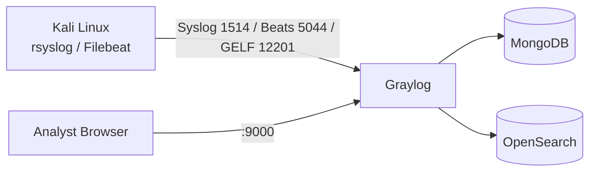

# AJSIEM

Security Information and Event Management lab built with **Ubuntu Server**, **OpenSearch**, **MongoDB**, **Graylog**, and **Kali Linux**.

This repository packages the end-to-end SIEM workflow described in portfolio form:

- Set up and implement a robust SIEM leveraging Ubuntu Server, OpenSearch, MongoDB, Graylog, and Kali Linux
- Orchestrate Kali Linux so it seamlessly transmits logs to the Ubuntu server for optimized collection
- Use OpenSearch to filter/index network and host telemetry, presented through the Graylog web UI
- Implement a comprehensive alert system stratified from **low → high** to identify and respond to specific network activity

## Stack

| Component | Role |
|-----------|------|
| **Kali Linux** | Log source / lab endpoint (rsyslog or Filebeat) |
| **Ubuntu Server** | SIEM host |
| **MongoDB** | Graylog metadata / buffer |
| **OpenSearch** | Indexed log storage & search backend |
| **Graylog** | Ingest, streams, search UI, alerts |



## Quick start (Docker on Ubuntu)

```bash
./scripts/ubuntu/generate-secrets.sh
# set GRAYLOG_HTTP_EXTERNAL_URI=http://<ubuntu-bridged-ip>:9000/
./scripts/ubuntu/start-stack.sh
./scripts/ubuntu/bootstrap-graylog.sh
```

On Kali (same bridged network):

```bash
sudo ./scripts/kali/setup-log-forwarding.sh <ubuntu-ip>
./scripts/kali/generate-lab-events.sh
```

Full steps: [docs/lab-guide.md](docs/lab-guide.md)

## Repository layout

```text
AJSIEM/
├── docker-compose.yml          # MongoDB + OpenSearch + Graylog
├── configs/
│   ├── rsyslog/                # Kali → Ubuntu forwarder
│   ├── filebeat/               # Optional Beats shipper
│   └── graylog/alerts/         # Low / medium / high alert catalog
├── scripts/
│   ├── ubuntu/                 # Secrets, start stack, bootstrap, bare-metal install
│   └── kali/                   # Log forwarding + sample event generator
└── docs/lab-guide.md
```

## Alerts (low → high)

| Level | Intent |
|-------|--------|
| **Low** | Baseline successful auth / routine sudo |
| **Medium** | Brute-force style failures, new accounts |
| **High** | Root login, scan indicators, priv-esc storms |

See `configs/graylog/alerts/alert-catalog.json`.

## Requirements

- Host with **≥ 8 GB RAM** and **≥ 50 GB** disk for the VM lab
- VirtualBox (or similar) with **Bridged** networking on both VMs
- Docker Engine on Ubuntu for Path A, **or** bare-metal packages via `install-baremetal.sh`

## License

Lab material for authorized / educational use only. Harden before any production exposure.
